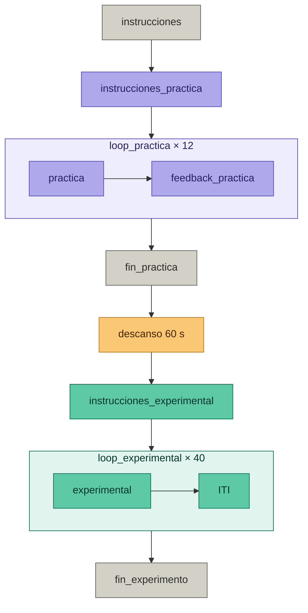

# Taller 1 — Categorización de Expresiones Emocionales

- **Asignatura:** Investigación e Intervención desde las Neurociencias Aplicadas  
- **Ciclo:** 2026-1  
- **Autor:** Marcelo Landa

---

## Descripción

Materiales del Taller 1 del curso, centrado en el diseño e implementación de una tarea de categorización de expresiones emocionales en PsychoPy Builder.

La tarea es una adaptación del Experimento 1 de Calvo & Lundqvist (2008) utilizando el **Ulima Emotional Faces Dataset**, un dataset de expresiones emocionales en rostros latinos desarrollado en la Universidad de Lima.

> **Nota:** El archivo `.psyexp` será completado durante el taller. Al finalizar la semana se subirá la versión resuelta a este repositorio.

---

## Cómo descargar los materiales

1. Hacer clic en el botón verde **`< > Code`** en la parte superior de esta página
2. Seleccionar **`Download ZIP`**
3. Descomprimir el archivo en tu computadora
4. Abrir PsychoPy Builder y cargar el archivo `categorizacion_emocional.psyexp`

> **Importante:** No mover ni renombrar ninguna carpeta. PsychoPy necesita encontrar los archivos exactamente en las rutas que se configurarán durante el taller.

---

## Estructura del repositorio

```
taller_1_emociones/
│
├── categorizacion_emocional.psyexp     # Archivo del experimento (se completa en el taller)
│
├── conditions/
│   ├── condiciones_experimental.xlsx   # 40 trials — fase experimental
│   └── condiciones_practica.xlsx       # 12 trials — fase de práctica con palabras
│
├── media/
│   ├── anger/        # Fotografías de ira      (anger_01.png … anger_40.png)
│   ├── fear/         # Fotografías de miedo    (fear_01.png … fear_40.png)
│   ├── happiness/    # Fotografías de alegría  (happiness_01.png … happiness_40.png)
│   ├── sadness/      # Fotografías de tristeza (sadness_01.png … sadness_40.png)
│   └── practice/     # Estímulos de la fase de práctica
│
└── README.md
```

---

## Diseño de la tarea

| Parámetro | Valor |
|---|---|
| Paradigma | Forced-choice, categorización emocional |
| Emociones | Alegría, Tristeza, Ira, Miedo |
| Teclas de respuesta | F (alegría) · G (tristeza) · H (ira) · J (miedo) |
| Trials de práctica | 12 (palabras escritas, 3 por emoción) |
| Trials experimentales | 40 (10 por emoción) |
| Presentación del estímulo | Free-viewing (hasta respuesta del participante) |
| ITI | 500 ms |
| Feedback | Solo en fase de práctica |
| Variables dependientes | Precisión (% correcto) y tiempo de reacción (ms) |

### Flujo de la tarea



---

## Análisis de resultados

Una vez completada la tarea, el CSV generado por PsychoPy puede procesarse en la aplicación web del curso:

**🔗 [marcelolanda.github.io/emotion-task-results](https://marcelolanda.github.io/emotion-task-results)**

No se requiere instalar ningún software adicional. Solo arrastra tu archivo CSV al navegador.

---

## Estímulos

Las fotografías provienen del **Ulima Emotional Faces Dataset**:

> Suni Lopez, F., Lopez Terrones, M. C., Henostroza Mesones, F., Guzman Martinez, J. M., Wissar Rodriguez, J. E., Pineda Palomino, D. A., & Sánchez López, Á. (2024-2025). *Ulima Emotional Faces Dataset: un enfoque computacional para la creación de un dataset de expresiones emocionales en rostros latinos utilizando análisis biométrico y machine learning*. Universidad de Lima. https://cris.ulima.edu.pe/es/projects/ulima-emotional-faces-dataset-un-enfoque-computacional-para-la-cr/

---

## Referencias

Calvo, M. G., & Lundqvist, D. (2008). Facial expressions of emotion (KDEF): Identification under different display-duration conditions. *Behavior Research Methods, 40*(1), 109-115. https://doi.org/10.3758/BRM.40.1.109

Peirce, J. W., Gray, J. R., Simpson, S., MacAskill, M. R., Hochenberger, R., Sogo, H., Kastman, E., & Lindelov, J. (2019). PsychoPy2: Experiments in behavior made easy. *Behavior Research Methods*. https://doi.org/10.3758/s13428-018-01193-y

---

## Contacto

**Marcelo Landa**  
Asistente de cátedra — Investigación e Intervención desde las Neurociencias Aplicadas  
Universidad de Lima